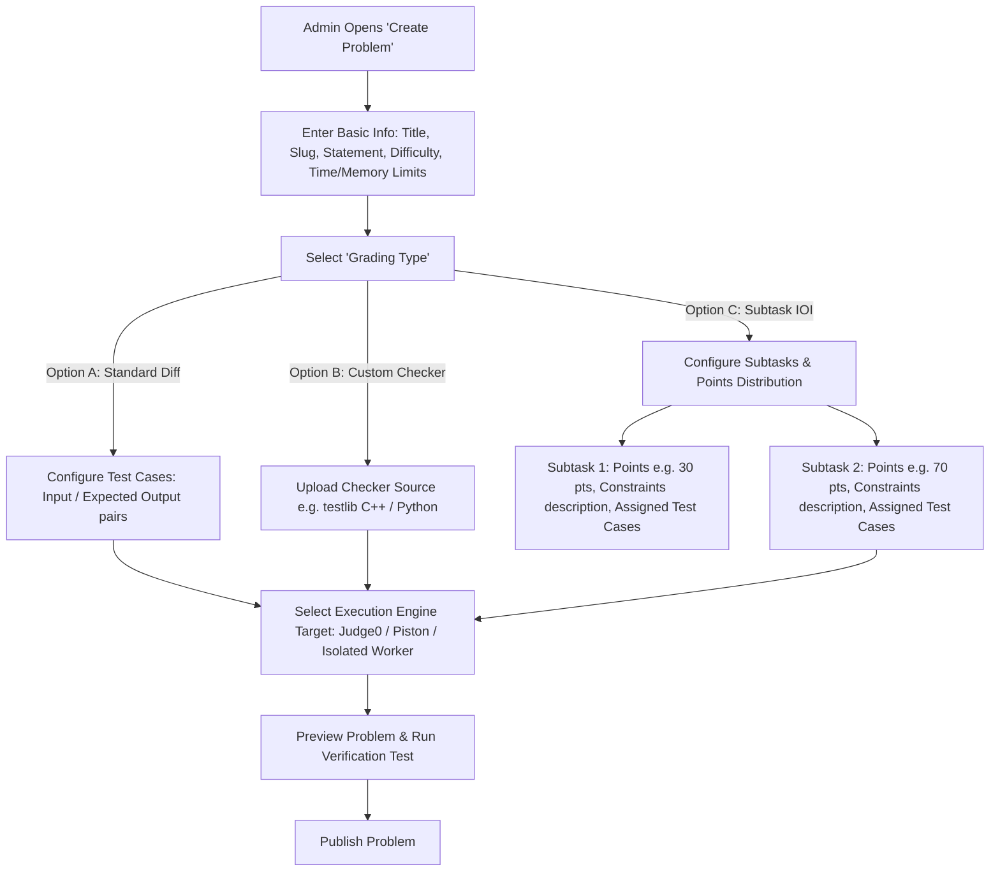
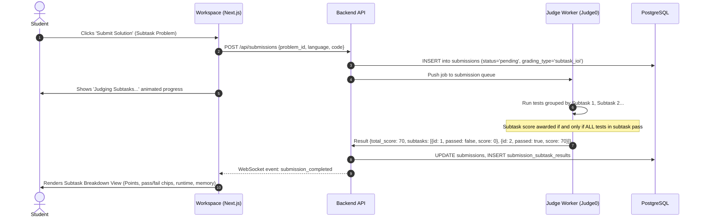
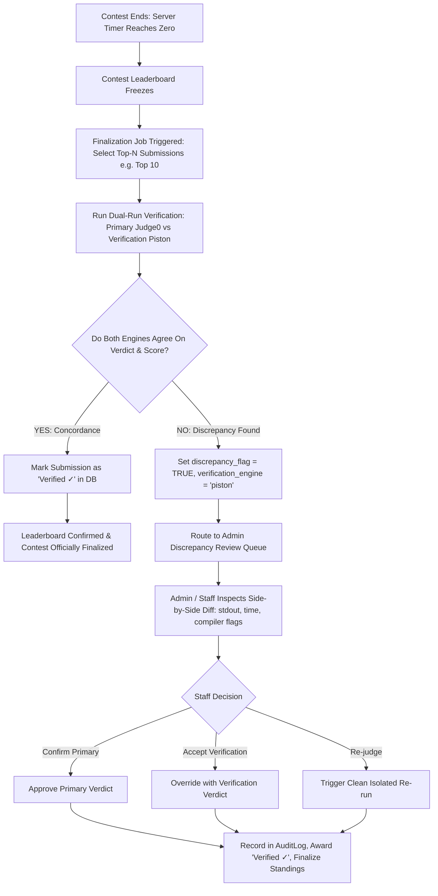
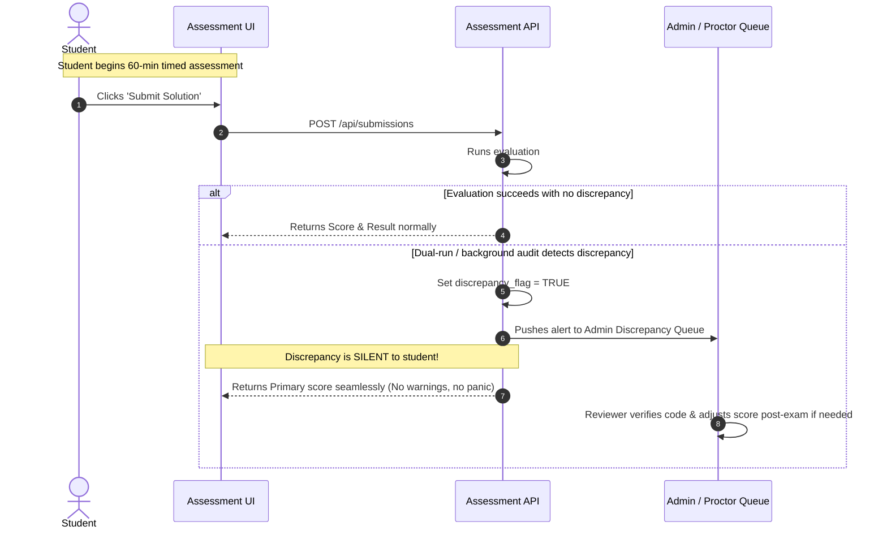

# End-to-End System & User Flows
**KILN-Code / DETOX Architecture Version 2.0**

---

## Flow 1: Admin Problem Creation with Grading-Type & Execution Engine Routing

### Key UI Decisions:
- When **Subtask-Based** is selected, the Test Case manager switches to group-by-subtask mode. Total problem points automatically sum the subtask points (e.g. 30 + 70 = 100).
- Execution engine defaults to `judge0` for sandboxed multi-language reliability.

---

## Flow 2: Student Submission & Subtask Breakdown Flow

---

## Flow 3: Contest Finalization & Dual-Run Verification Flow (Narrow Trigger)

### Crucial Invariants:
1. **No ongoing A/B routing**: Regular practice and live contest submissions run on the standard execution engine (`judge0`).
2. **Narrow Trigger**: Dual-run is exclusively fired during the contest finalization phase for top contenders.
3. **Trust Seal**: Only submissions that have passed dual-run verification earn the **"Verified ✓"** trust badge.

---

## Flow 4: Strict Assessment Session with Silent Discrepancy Handling

